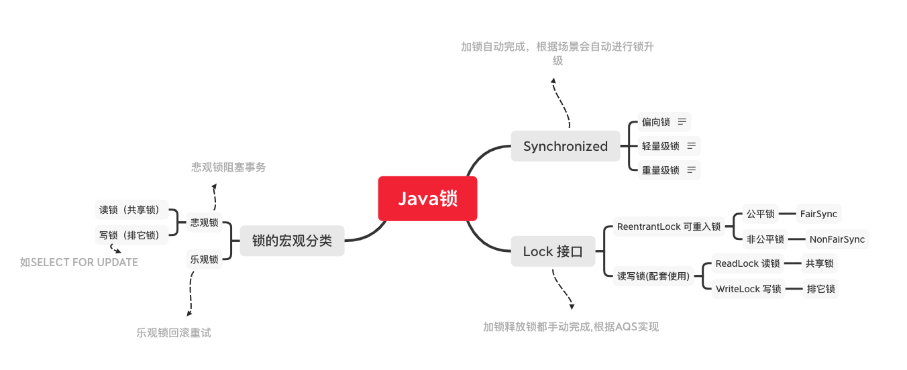
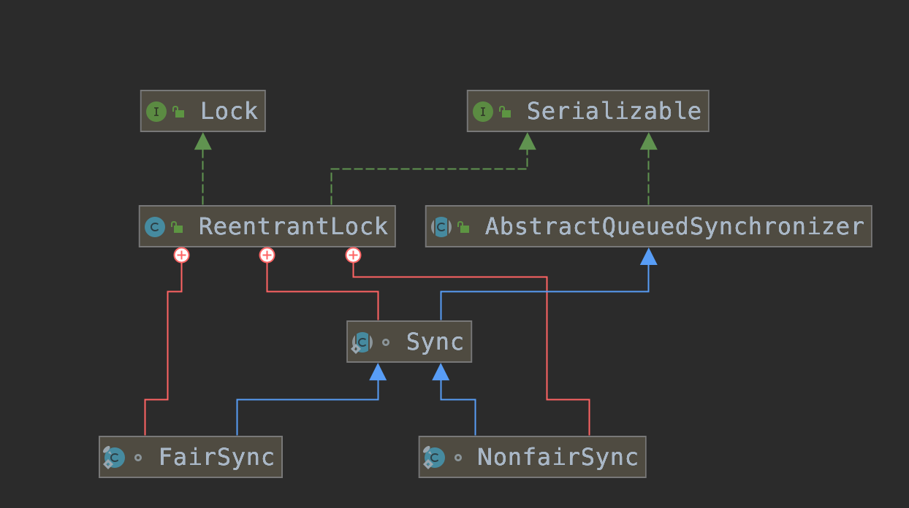

# Java 并发编程

## 多线程编程产生的问题？
> 通常在聊及并发编程时，通常是在说多线程编程，因此我们首先从问题出发看下多线程编程有哪些问题？
``` 
package com.izhengyin.demo.concurrent.part1;
import com.izhengyin.demo.concurrent.SleepUtils;
import java.util.concurrent.ExecutorService;
import java.util.concurrent.Executors;
import java.util.stream.IntStream;

/**
 * @author zhengyin
 */
public class MultiThreadIssue {
    private static int COUNTER = 0;
    private static final int MAX_VALUE = 10;
    public static void main(String[] args){
        changeAndWatch();
        recorder();
    }

    /**
     * 不会有任何输出
     */
    private static void changeAndWatch(){
        ExecutorService executor = Executors.newFixedThreadPool(2);
        // change
        executor.execute(() -> {
            IntStream.rangeClosed(0,MAX_VALUE)
                    .forEach(i -> {
                        COUNTER = i;
                        SleepUtils.sleep(100);
                    });
        });

        // watch 1
        executor.execute(() -> {
            int threadValue = COUNTER;
            while (COUNTER < MAX_VALUE){
                if(threadValue != COUNTER){
                    System.out.println(Thread.currentThread().getName()+" counter change old "+threadValue+" , new "+COUNTER);
                    threadValue = COUNTER;
                }
            }
        });
        executor.shutdown();
    }

    /**
     * 可能会输出 get wrong value
     */
    private static void recorder(){
        ExecutorService executor = Executors.newFixedThreadPool(2);
        // 未加锁
        IntStream.rangeClosed(0,1000000)
                .forEach(i -> {
                    ReorderExample example = new ReorderExample();
                    executor.execute(example::write);
                    executor.execute(example::read);
                });
        executor.shutdown();
    }

    /**
     * 从排序测试
     */
    private static class ReorderExample {
        private int a = 0;
        private boolean flag = false;
        public void write(){
            a = 1;
            flag = true;
        }
        public void read(){
            if(flag){
                if(a != 1){
                    System.out.println("get wrong value , a != 1 ");
                }
            }
        }
    }
}
```
* 在 changeAndWatch 的测试中，我们的初衷是希望能够监听到 COUNTER 的变化，然后打印出来，但从实际运行结果来看，不会有任何输出。
* 在 recorder 的测试中，我们期望的结果是当 flag 为true时，a 的值肯定是已经改变了的，但是我们在执行过程中会得到 get wrong value 的输出，显然不符合我们的预期。

## 多线程编程产生问题的原因？

* 为了优化性能，编译器、处理器常常会通过从排序来改变某些执行顺序，从而达到优化的目的
	1. 编译器优化的重排序。编译器在不改变单线程程序语义的前提下，可以重新安排语义。
	2. 指令级并行的重排序。现代处理器采用了指令级并行技术（Instruction-Level Parallelism，ILP）来将多条指令重叠执行。如果不存在数据依赖性，处理器可以改变语句对应机器指令的执行顺序。
	3. 内存系统的重排序。由于处理器使用缓存和读/写缓冲区，这使得加载和存储操作看上去可能是在乱序执行。
    

> 但是不管怎么排序，（单线程）程序的执行结果不能被改变。编译器、runtime和处理器都必须遵守as-if-serial语义。


### 如何去禁止这些排序？

> 在考虑如何去禁止从排序时，我们先来看看是谁在管理这些从排序规则。
>
> JMM（Java Memory Model），JMM属于语言级别的内存模型，管理的核心 目的是对缓存、写缓冲区、寄存器以及其他的硬件和编译器优化，通过禁止特点类型的编译器重排序和处理器重排序，为程序员提供一致的内存可见性保证。


> 这个图描述的意思是，每个线程都有自己的一块本地内存，然后多个线程同时还有一块共享内存区域，而本地内存与共享内存之间的桥梁就JMM控制的区域了。
> 这个特点和CPU高速缓存很像 [计算机组成原理-高速缓存](https://time.geekbang.org/column/article/109331?utm_campaign=guanwang&utm_source=baidu-ad&utm_medium=ppzq-pc&utm_content=title&utm_term=baidu-ad-ppzq-title)

#### JMM是通过什么原则控制的呢？  happens-before
> 以下摘自《Java并发编程》 一书
1. 程序顺序规则:一个线程中的每个操作，happens-before于该线程中的任意后续操作。
2. 监视器锁规则:对一个锁的解锁，happens-before于随后对这个锁的加锁。
3. volatile变量规则:对一个volatile域的写，happens-before于任意后续对这个volatile域的读。
4. 传递性:如果A happens-before B，且B happens-before C，那么A happens-before C。
5. start()规则:如果线程A执行操作ThreadB.start()(启动线程B)，那么A线程的ThreadB.start()操作happens-before于线程B中的任意操作。
6. join()规则:如果线程A执行操作ThreadB.join()并成功返回，那么线程B中的任意操作happens-before于线程A从ThreadB.join()操作成功返回。
> 以下是我的总结
1. happens-before仅仅要求前一个操作(执行的结果)对后一个操作可见，且前一个操作按顺序排在第二个操作之前(the first is visible to and ordered before the second)。（注意 happens-before强调可见性 ， 而编译器真正执行的时候可能不是按照我们观察的顺序执行的，但是这不重要）
2. 程序顺序规则:一个线程中的每个操作，happens-before 于该线程中的任意后续操作。(也就是说后面的顺序代码可以读取到前面代码的最终结果)
3. 监视器锁规则:对一个锁的解锁，happens-before于随后对这个锁的加锁;（在多线程场景后续的锁可以读取到前面锁的最终结果，比如synchronized对同一个对象加锁)
4. volatile变量规则:对一个volatile域的写，happens-before于任意后续对这个volatile域的读。(一个volatile值的更新，后续读这个变量都应该看到这个值的更新)
5. start()规则 ，join()规则 ； （多个线程执行有依赖关系，先执行的结果对后执行的可见）

#### 同步原语 ， synchronized,volatile
> 通过对happens-before的描述，里面提到了一些控制原则，而在这些原则中我们可以通过代码进行修饰的叫做同步原语，
> 下面我们就通过这两个同步原语修改 MultiThreadIssue 使其能够正常的运行。
``` 
package com.izhengyin.demo.concurrent.part2;

import com.izhengyin.demo.concurrent.SleepUtils;

import java.util.concurrent.ExecutorService;
import java.util.concurrent.Executors;
import java.util.stream.IntStream;

/**
 * @author zhengyin
 */
public class FixMultiThreadIssue {
    private static volatile int COUNTER = 0;
    private static final int MAX_VALUE = 10;
    public static void main(String[] args){
        changeAndWatch();
        changeAndWatch2();
        reorder();
    }

    /**
     * 将变量设置为 volatile 能够正常检查到值的变化
     */
    private static void changeAndWatch(){
        ExecutorService executor = Executors.newFixedThreadPool(3);
        // change
        executor.execute(() -> {
            IntStream.rangeClosed(0,MAX_VALUE)
                    .forEach(i -> {
                        COUNTER = i;
                        SleepUtils.sleep(100);
                    });
        });

        // watch 1
        executor.execute(() -> {
            int threadValue = COUNTER;
            while (COUNTER < MAX_VALUE){
                if(threadValue != COUNTER){
                    System.out.println(Thread.currentThread().getName()+" counter change old "+threadValue+" , new "+COUNTER);
                    threadValue = COUNTER;
                }
            }
        });
        executor.shutdown();
    }

    /**
     * 通过 synchronized watch1 也可以正常检查到值的变化
     */
    private static void changeAndWatch2(){
        ExecutorService executor = Executors.newFixedThreadPool(2);
        // change
        executor.execute(() -> {
            IntStream.rangeClosed(0,MAX_VALUE)
                    .forEach(i -> {
                        synchronized (FixMultiThreadIssue.class){
                            COUNTER = i;
                        }
                        SleepUtils.sleep(100);
                    });
        });

        // watch 1
        executor.execute(() -> {
            int threadValue = COUNTER;
            while (COUNTER < MAX_VALUE){
                synchronized (FixMultiThreadIssue.class){
                    if(threadValue != COUNTER){
                        System.out.println(Thread.currentThread().getName()+" counter change old "+threadValue+" , new "+COUNTER);
                        threadValue = COUNTER;
                    }
                }
            }
        });
        executor.shutdown();
    }

    /**
     * 通过修改 flag 为 volatile 程序不会在输出 get wrong value 的错误
     */
    private static void reorder(){
        ExecutorService executor = Executors.newFixedThreadPool(2);
        // 未加锁
        IntStream.rangeClosed(0,1000000)
                .forEach(i -> {
                    ReorderExample example = new ReorderExample();
                    executor.execute(example::write);
                    executor.execute(example::read);
                });
        executor.shutdown();
    }

    /**
     * 从排序测试
     */
    private static class ReorderExample {
        private int a = 0;
        private volatile boolean flag = false;
        public void write(){
            a = 1;
            flag = true;
        }
        public void read(){
            if(flag){
                if(a != 1){
                    System.out.println("get wrong value , a != 1 ");
                }
            }
        }
    }
}
```

## 并发编程同步原语

在之前的内容中我们提到了通过同步原语 synchronized,volatile 可以取禁止一些从排序从而保证了多线程编程下逻辑的正确性。
但同时我们也提到了，JMM通过从排序来优化程序性能，因此可以想到  synchronized,volatile 是会对应用程序性能有损耗的，而且在一些场景下损耗还不小，因此如何正确的使用同步原语是我们需要关注的。
首先我们先来认识一下volatile与synchronized。

### volatile 

#### volatile的定义如下

> Java编程语言允许线程访问共享变量，为了确保共享变量能被准确和一致地更新，线程应该确保通过排他锁单独获得这个变量。因此下面这段程序是错误的。

```
public class WrongUseVolatile {
    private static volatile int counter = 0;
    public static void main(String[] args){
        ExecutorService executorService = Executors.newFixedThreadPool(10);
        IntStream.rangeClosed(0,10000)
                .forEach(i -> executorService.execute(WrongUseVolatile::inc));
        SleepUtils.sleep(1000);
        //结果并不一定等于 10000
        System.out.println("counter -> "+counter);
        executorService.shutdown();
    }
    private static void inc(){
        counter ++;
    }
}
```

### volatile实现的2条原则

1. Lock前缀指令会引起处理器缓存回写到内存。
2. 一个处理器的缓存回写到内存会导致其他处理器的缓存无效。

volatile的这两条原则我理解的就是让CPU如何和内存/缓存打交道,处理器使用MESI控制协议去维护内部缓存和其他处理器缓存的一致性。
极客时间[计算机组成原理-MESI协议](https://time.geekbang.org/column/article/109874)专栏文章有详细的描述。

#### 测试使用Volatile对应用性能的影响
```
public class VolatileTest {
    private static volatile String v;
    public static void main(String[] args){
        ExecutorService executorService = Executors.newFixedThreadPool(100);
        long sTime = System.currentTimeMillis();
        int loop = 1000000;
        IntStream.rangeClosed(0,loop)
                .forEach(i -> {
                    executorService.execute(() -> {
                        //构建一个字符串，赋值给 volatile 变量
                        int size = i % 1000;
                        StringBuffer sb = new StringBuffer(size);
                        IntStream.rangeClosed(0,size).forEach(sb::append);
                        v = sb.toString();
                        //打印耗时
                        if(i == loop){
                            System.out.println((System.currentTimeMillis() - sTime) +"ms");
                        }
                    });
                });
        SleepUtils.sleep(5000);
        executorService.shutdown();
    }
}
```

执行100万次，在我电脑上（2017款iMac）相差300MS左右 , 折算到每次请求消耗不大。

### synchronized 

> synchronized可以通过语义描述，实现自动加锁解锁的功能，对于synchronized ， Java中的每一个对象都可以作为锁，具体表现为以下3种形式。

1. 对于普通同步方法，锁是当前实例对象。
    ```
    private synchronized void sync() {} 
    ```
2. 对于静态同步方法，锁是当前类的Class对象。
    ```
    private synchronized static void sync() {} 
    ```
3. 对于同步方法块，锁是 synchronized 括号里配置的对象。
    ```
    synchronized(object){}
    ```

Java SE 1.6为了减少获得锁和释放锁带来的性能消耗，引入了“偏向锁”和“轻量级锁”，在 Java SE 1.6中，锁一共有4种状态，级别从低到高依次是:无锁状态、偏向锁状态、轻量级锁状态和重量级锁状态，这几个状态会随着竞争情况逐渐升级。

#### 测试使用synchronized对应用性能的影响

```
public class SynchronizedTest {
    public static void main(String[] args){
        Map<String,Long> timeCounter = new HashMap<>(100);
        CountDownLatch countDownLatch = new CountDownLatch(100);
        ExecutorService executorService = Executors.newFixedThreadPool(100);
        //执行100次
        IntStream.rangeClosed(0,100)
                .forEach(i -> {
                    final String executeKey = "execute-"+i;
                    timeCounter.put(executeKey,System.currentTimeMillis());
                    executorService.execute(() -> {
                        //每次执行都模拟100MS延迟
                        calculate(100);
                        //记录每一次执行的耗时
                        System.out.println(executeKey+" -> "+(System.currentTimeMillis() - timeCounter.get(executeKey))+" ms");
                        countDownLatch.countDown();
                    });
                });
        try {
            countDownLatch.await();
        }catch (InterruptedException e){
            e.printStackTrace();
        }
        executorService.shutdown();
    }

    private synchronized static void calculate(long delay){
        SleepUtils.sleep(delay);
    }
}
```

程序运行完耗时10000MS以上，可见对于加锁的方法,如果执行较慢对于性能影响是巨大的。因此加锁要慎重，如果只是可见性问题，用volatile会比synchronized好。

## CAS （Compare And Swap）

在通过对同步原语的学习，实现一个线程安全的计数器，已经不是问题了。但是在现代多核CPU中实现counter ++ 可不容易。
如果有一个变量 i = 1 , 我们进行两次 i ++ 的操作，期望结果是3，但是实际结果可能不一定,原因可能是两个CPU分别在自己的内部缓存区域相加。


### 处理器如何实现原子操作

1. 通过总线锁保证原子性
    * 通过LOCK#信号，阻塞其它CPU达到独占内存的目的
2. 使用缓存锁保证原子性 
    * 缓存一致性，MESI协议
    
在这两种方式中，第二种比第一种开销要小，那么CPU在什么情况下会不选择第二种呢？
1. 当操作的数据不能被缓存在处理器内部，或操作的数据跨多个缓存行
   (cache line)时，则处理器会调用总线锁定。
2. 有些处理器不支持缓存锁定。

针对以上两个机制，通过Intel处理器提供了很多Lock前缀的指令来实现。例如，位测试和修改指令:BTS、BTR、BTC;交换指令XADD、CMPXCHG，以及其他一些操作数和逻辑指令(如ADD、OR)等，被这些指令操作的内存区域就会加锁，导致其他处理器不能同时访问它。
在我们今天的话题中，我们关注 CMPXCHG 这个指令, CPMXCHG 就是一个比较并交换指令，是CPU硬件支持的机器指令。


### Java如何实现原子操作

Java中通过锁与循环CAS来保证原子操作,锁(synchronized)在同步原语中我们已经介绍过了，现在我们来看下什么是循环CAS。

#### 什么是循环CAS？ 

我们通过 AtomicInteger#getAndIncrement 方法来了解一下循环CAS

* getAndIncrement 定义

getAndIncrement调用 Unsafe.getAndAddInt 完成原子的 + 1 操作，传入三个参数分别是，当前对象
、valueOffset、1 。


```
    /**
     * 原子的加 1
     * @return 增加前的值
     */
    public final int getAndIncrement() {
        return unsafe.getAndAddInt(this, valueOffset, 1);
    }
```

第一个和第三个参数都很明显，我们来看下 valueOffset 是怎么获取的。


```
    ...
    private static final long valueOffset;

    static {
        try {
            valueOffset = unsafe.objectFieldOffset
                (AtomicInteger.class.getDeclaredField("value"));
        } catch (Exception ex) { throw new Error(ex); }
    }

    private volatile int value;
    
    ...
```

通过上面的代码可以看到，valueOffset通过Unsafe#objectFieldOffset获取的int变量value的内存地址偏移位，接下来在看下Unsafe#getAndAddInt方法的定义，通过方法的注释应该能够明白方法的含义。
    
``` 
  /**
     * 原子的将位于对象 o 内存偏移位 offset 处的 Int value 的值增加 delta
     * @param o 对象
     * @param offset (对象o的Int value)内存偏移位
     * @param delta 增加的值
     * @return 增加前的值
     */
    public final int getAndAddInt(Object o, long offset, int delta) {
        int v;
        do {
            v = getIntVolatile(o, offset);
        } while (!compareAndSwapInt(o, offset, v, v + delta));
        return v;
    }
```
根据上面的代码分析，我们来描述一下CAS自旋的过程。
假设有两个线程同时对Value = 1 的值加1，那么它们的执行过程如下图。
1. 线程A getIntVolatile 获取到 value = 1
2. 线程B getIntVolatile 获取到 value = 1
3. 线程A 调用 compareAndSwapInt 期望将  value = 1 的值设置为 2
4. 线程B 调用 compareAndSwapInt 期望将  value = 1 的值设置为 2
5. 线程A 通过调用 CMPXCHG 指令进行修改，此时 Value = 1 与线程A局部变量里的值一致，修改成功 ， Value 变为 2
6. 线程B 通过调用 CMPXCHG 指令进行修改，此时 Value = 2 (因为Value已经被线程A修改为2) 与 线程A局部变量里的值不一致，修改失败
7. 线程B while 进入下一次循环
8. 线程B 由于Volatile的特性，通过 getIntVolatile 线程A可以立即获取到线程B修改的 value = 2 ；
9. 线程B 调用 compareAndSwapInt 期望将  value = 2 的值设置为 3
10. 线程B 通过调用 CMPXCHG 指令进行修改，此时 Value = 2 与线程B局部变量里的值一致，修改成功 ， Value 变为 3


#### CAS存在的问题

1. ABA问题

    cas的ABA问题就是假设初始值为A，线程3和线程1都获取到了初始值A，然后线程1将A改为了B，线程2将B又改回了A，这时候线程3做修改时，是感知不到这个值从A改为了B又改回了A的过程。类似于下面这段伪代码
    ``` 
    final AtomicInteger atomicInteger = new AtomicInteger(1);
    atomicInteger.compareAndSet(1,2)  A -> B
    atomicInteger.compareAndSet(2,1)  B -> A
    atomicInteger.compareAndSet(1,3)  A -> C (可能不会感知到 B -> A 的过程)
    ```
    
2. 循环时间长开销大

    自旋CAS通过while循环来完成的，因此如果长时间不成功，会给CPU带来非常大的执行开销。

3. 只能保证一个共享变量的原子操作

    通过上面的代码可以看到，CAS只能保证一个Int共享变量的操作。
    
    
#### CAS存在的问题如何避免？

1. 使用 AtomicStampedReference 增加版本号的方式来避免 ABA的问题
    

``` 
public class CasABA {
    public static void main(String[] args) throws InterruptedException{
        System.out.println("abaProblem ");
        abaProblem();
        System.out.println("fixAbaProblem ");
        fixAbaProblem();
    }

    /**
     * 产生ABA问题的代码
     * @throws InterruptedException
     */
    private static void abaProblem() throws InterruptedException{
        ExecutorService executorService = Executors.newFixedThreadPool(2);
        CountDownLatch countDownLatch = new CountDownLatch(2);
        final AtomicInteger atomicInteger = new AtomicInteger(1);
        executorService.execute(() -> {
            System.out.println(atomicInteger.compareAndSet(1,2)+" -> "+atomicInteger.get());
            System.out.println(atomicInteger.compareAndSet(2,1)+" -> "+atomicInteger.get());
            countDownLatch.countDown();
        });
        executorService.execute(() -> {
            SleepUtils.sleep(100);
            System.out.println(atomicInteger.compareAndSet(1,3)+" -> "+atomicInteger.get());
            countDownLatch.countDown();
        });
        countDownLatch.await();
        executorService.shutdown();
    }

    /**
     * 通过增加数据版本来避免ABA问题
     * @throws InterruptedException
     */
    private static void fixAbaProblem() throws InterruptedException{
        ExecutorService executorService = Executors.newFixedThreadPool(2);
        CountDownLatch countDownLatch = new CountDownLatch(2);
        final AtomicStampedReference<Integer> atomicInteger = new AtomicStampedReference<Integer>(1,0);
        final int initStamp = atomicInteger.getStamp();
        executorService.execute(() -> {
            int stamp = initStamp;
            System.out.println(atomicInteger.compareAndSet(1,2,stamp,++stamp) +" -> "+atomicInteger.getReference());
            System.out.println(atomicInteger.compareAndSet(2,1,stamp,++stamp) +" -> "+atomicInteger.getReference());
            countDownLatch.countDown();
        });
        executorService.execute(() -> {
            int stamp = initStamp;
            SleepUtils.sleep(100);
            System.out.println(atomicInteger.compareAndSet(1,3,stamp,++stamp) +" -> "+atomicInteger.getReference());
            countDownLatch.countDown();
        });
        countDownLatch.await();
        executorService.shutdown();
    }

}
```

2. 循环时间长开销大

    这个问题从编码上没有好的解决办法，在《java并发的艺术编程》提到jvm能支持处理器提供的pause指令，那么效率会有一定的提升。 这里有篇文章是对[pause](https://blog.csdn.net/misterliwei/article/details/3951103)指令的描述。

3. 可以通过对引用类型的更新来同时跟新多个值,注意比较交换时，比较的是引用对象的内存的地址而不是 equals ，下面的代码演示的这样的情况。
    

``` 
package com.izhengyin.demo.concurrent.part5;

import lombok.AllArgsConstructor;
import lombok.Data;
import lombok.ToString;
import java.util.Objects;
import java.util.concurrent.atomic.AtomicReference;
/**
 * @author zhengyin zhengyinit@outlook.com
 * Created on 2020-09-07 18:52
 */
public class AtomicReferenceTest {

    public static void main(String[] args){
        Coord coord = new Coord(1.1,5.1);

        Coord newCoord = new Coord(2.1,6.1);
        AtomicReference<Coord> coordAtomicReference1 = new AtomicReference<>(coord);
        //成功
        System.out.println("compareAndSet ["+coordAtomicReference1.compareAndSet(coord,newCoord)+"] , new value "+coordAtomicReference1.get());

        Coord coord2 = new Coord(1.1,5.1);
        AtomicReference<Coord> coordAtomicReference2 = new AtomicReference<>(coord);
        //失败
        System.out.println("compareAndSet ["+coordAtomicReference2.compareAndSet(coord2,newCoord)+"] , equals ["+(coord2.equals(coord))+"] , new value "+coordAtomicReference2.get());
    }

    @Data
    @ToString
    @AllArgsConstructor
    private static class Coord {
        private double x;
        private double y;

        @Override
        public boolean equals(Object o) {
            if (this == o) {
                return true;
            }
            if (o == null || getClass() != o.getClass()){
                return false;
            }
            Coord coord = (Coord) o;
            return Double.compare(coord.x, x) == 0 &&
                    Double.compare(coord.y, y) == 0;
        }

        @Override
        public int hashCode() {
            return Objects.hash(x, y);
        }
    }

}

```
以上代码输出
``` 
compareAndSet [true] , new value AtomicReferenceTest.Coord(x=2.1, y=6.1)
compareAndSet [false] , equals [true] , new value AtomicReferenceTest.Coord(x=1.1, y=5.1)
```


## Java中的锁

在之前的文章中我们接触到了 synchronized ，这个是JDK给我提供的一个"自动锁"，加锁、释放锁全部有JDK自动完成，非常便捷，但方便终归是有代价的，那就是丧失了一些灵活性，比如无法响应中断、无法设置锁等待超时等，接下来的章节我们将系统的来了解一下Java中的锁。

我们先来看一张图,本章也将围绕这张图展开



### 锁的宏观分类

悲观锁总是假设最坏的情况，因此在读写数据的时候都会上锁,以阻止其它的程序（线程）对数据的读写，在锁释放前，其它程序（线程）读写数据都将被挂起。
乐观锁总是假设最好的情况，因此在读写数据时不会上锁,但是为了数据的正确的写入会在数据写入时通过版本比较来保证正确性，如果比较失败，那么程序直接退出，这时可以返回错误或循环重试。

悲观锁阻塞事务，乐观锁回滚重试，它们各有优缺点。

在实际的应用中悲观锁的阻塞会导致大量事务的超时，从而影响整个系统的吞吐量，乐观锁通过循环比较来更新数据，从而在锁冲突较少的情况下，加大了系统的吞吐量，但是如果锁冲突严重，长时间的循环重试，势必也会影响性能。

> 所谓乐观锁就是无锁，实际上就是不加锁 ，因为他并不会阻塞其余线程读写， 类似CAS 或 RDBS通过数据版本号来判断更新数据。

### synchronized 锁的不同阶段

初次执行到synchronized代码块的时候，锁对象变成偏向锁（通过CAS修改对象头里的锁标志位），字面意思是“偏向于第一个获得它的线程”的锁。执行完同步代码块后，线程并不会主动释放偏向锁。当第二次到达同步代码块时，线程会判断此时持有锁的线程是否就是自己（持有锁的线程ID也在对象头里），如果是则正常往下执行。由于之前没有释放锁，这里也就不需要重新加锁。如果自始至终使用锁的线程只有一个，很明显偏向锁几乎没有额外开销，性能极高。
一旦有第二个线程加入锁竞争，偏向锁就升级为轻量级锁（自旋锁）。这里要明确一下什么是锁竞争：如果多个线程轮流获取一个锁，但是每次获取锁的时候都很顺利，没有发生阻塞，那么就不存在锁竞争。只有当某线程尝试获取锁的时候，发现该锁已经被占用，只能等待其释放，这才发生了锁竞争.
在轻量级锁状态下继续锁竞争，没有抢到锁的线程将自旋，即不停地循环判断锁是否能够被成功获取。获取锁的操作，其实就是通过CAS修改对象头里的锁标志位。先比较当前锁标志位是否为“释放”，如果是则将其设置为“锁定”，比较并设置是原子性发生的。这就算抢到锁了，然后线程将当前锁的持有者信息修改为自己。
长时间的自旋操作是非常消耗资源的，一个线程持有锁，其他线程就只能在原地空耗CPU，执行不了任何有效的任务，这种现象叫做忙等（busy-waiting）。如果多个线程用一个锁，但是没有发生锁竞争，或者发生了很轻微的锁竞争，那么synchronized就用轻量级锁，允许短时间的忙等现象。这是一种折衷的想法，短时间的忙等，换取线程在用户态和内核态之间切换的开销。
显然，此忙等是有限度的（有个计数器记录自旋次数，默认允许循环10次，可以通过虚拟机参数更改）。如果锁竞争情况严重，某个达到最大自旋次数的线程，会将轻量级锁升级为重量级锁（依然是CAS修改锁标志位，但不修改持有锁的线程ID）。当后续线程尝试获取锁时，发现被占用的锁是重量级锁，则直接将自己挂起（而不是忙等），等待将来被唤醒。在JDK1.6之前，synchronized直接加重量级锁，很明显现在得到了很好的优化。

### JDK中的Lock工具类

JDK为我们提供了一系列的锁的工具类，它们被定义在 java.util.concurrent.locks 包下，这些工具类围绕Lock接口与AbstractQueuedSynchronizer(AQS)进行构建，Lock接口定义了加锁、释放锁的API，而AQS是对加锁、锁释锁实现的抽象。

#### 可重入锁 ReentrantLock 



ReentrantLock 实现了Lock的接口，在ReentrantLock中定义了3个内部类，Sync类是对AQS的抽象接口的实现，FairSync 、 NonfairSync 继承自 Sync 实现了 Sync 类抽象出的lock方法，实现了公平锁与非公平锁的加锁策略。 
ReentrantLock 在实例化时可以通过构造函数指定是否使用公平锁，接下来我们通过示例与源码介绍可重入锁、公平锁、非公平锁的具体实现。


下面我们通过源码来分析产生这些现象的原因。

1. 可重入锁的实现逻辑


``` 
    else if (current == getExclusiveOwnerThread()) {
        int nextc = c + acquires;
        if (nextc < 0)
            throw new Error("Maximum lock count exceeded");
        setState(nextc);
        return true;
    }
```

可重入锁通过构造函数来指定是否使用在公平锁与非公平锁，在公平锁 tryAcquire 以及非公平锁 nonfairTryAcquire 方法内都有以上一个判断分支用于实现线程的重入。
上面这个代码的意思是，当当前的线程是获得锁的线程（getExclusiveOwnerThread）时，将锁状态计数器加1(acquires=1),如果小于0（int 溢出了）就抛异常，也就是说最大能够加到 Integer.MAX_VALUE。
每一次释放锁的会将 state - 1 ，直到 state = 0 时其它线程才可以拿到锁。下面这段代码演示了可重入锁的特点。
``` 

    /**
     * 当占有锁的线程获取到的锁都释放以后，其它等待线程才可以获取锁。
     */
    public static void reentrant(){
        ReentrantLock lock = new ReentrantLock();
        IntStream.rangeClosed(0,10).forEach(i -> {
            lock.lock();
            System.out.println(System.currentTimeMillis()+" Get Lock "+Thread.currentThread().getName());
        });

        Thread thread = new Thread(() -> {
            lock.lock();
            try {
                System.out.println(System.currentTimeMillis()+" Get Lock "+Thread.currentThread().getName());
            }finally {
                lock.unlock();
                System.out.println(System.currentTimeMillis()+" unLock "+Thread.currentThread().getName());
            }
        });
        thread.start();


        IntStream.rangeClosed(0,10).forEach(i -> {
            SleepUtils.sleep(100);
            lock.unlock();
            System.out.println(System.currentTimeMillis()+" unLock "+Thread.currentThread().getName());
        });

        try {
            thread.join();
        }catch (InterruptedException e){

        }
    }
```
输出
``` 
1600316511297 Get Lock main
1600316511297 Get Lock main
1600316511297 Get Lock main
1600316511297 Get Lock main
1600316511297 Get Lock main
1600316511297 Get Lock main
1600316511297 Get Lock main
1600316511297 Get Lock main
1600316511297 Get Lock main
1600316511297 Get Lock main
1600316511297 Get Lock main
1600316511400 unLock main
1600316511504 unLock main
1600316511608 unLock main
1600316511712 unLock main
1600316511817 unLock main
1600316511922 unLock main
1600316512027 unLock main
1600316512131 unLock main
1600316512235 unLock main
1600316512338 unLock main
1600316512441 unLock main
1600316512442 Get Lock Thread-0
1600316512442 unLock Thread-0
```

2. 公平锁的实现

在公平锁 tryAcquire 获取锁时，会先检查是否有等待队列 hasQueuedPredecessors() 如果有等待队列线程竞争锁将失败，然后根据AQS的实现，线程将被加入到等待队尾。
下面这段代码中，线程将按照先后顺序依次执行。

``` 
    private static void fair(){
        ReentrantLock failLock = new ReentrantLock(true);
        IntStream.rangeClosed(0,10).forEach(i -> {
            new Thread(() -> {
                failLock.lock();
                try {
                    System.out.println(Thread.currentThread().getName()+" -> "+i);
                }finally {
                    failLock.unlock();
                }
            },"thread-"+i).start();
        });

    }
```
输出
``` 
thread-0 -> 0
thread-1 -> 1
thread-2 -> 2
thread-3 -> 3
thread-4 -> 4
thread-5 -> 5
thread-6 -> 6
thread-7 -> 7
thread-8 -> 8
thread-9 -> 9
thread-10 -> 10
```

3. 非公平锁的实现

在非公平锁 nonfairTryAcquire 方法中，会先进行一次 CAS 来竞争锁，如果竞争失败才会被加入等待队列，如果竞争成功就插队执行。

``` 
    if (compareAndSetState(0, acquires)) {
        setExclusiveOwnerThread(current);
        return true;
    }
```

在下面这段代码中，执行时乱序的。

``` 
 private static void nonFair(){
        ReentrantLock nonFairLock = new ReentrantLock();
        IntStream.rangeClosed(0,10).forEach(i -> {
                    new Thread(() -> {
                        nonFairLock.lock();
                        try {
                            System.out.println(Thread.currentThread().getName()+" -> "+i);
                        }finally {
                            nonFairLock.unlock();
                        }
                    },"thread-"+i).start();
                });


    }
```
输出

``` 
thread-0 -> 0
thread-2 -> 2
thread-1 -> 1
thread-3 -> 3
thread-4 -> 4
thread-5 -> 5
thread-6 -> 6
thread-7 -> 7
thread-8 -> 8
thread-9 -> 9
thread-10 -> 10
```

#### 读锁写锁

读锁写锁是一对锁，在使用时通常配合使用。我们通过下面两段代码来看看它们的特点

* 读锁可以被多个线程获取,但当写锁被占有时，读锁的获取都将被阻塞。

``` 
    private static void readLock(){
        ReentrantReadWriteLock wrl = new ReentrantReadWriteLock();
        ExecutorService executorService = Executors.newFixedThreadPool(5);
        IntStream.rangeClosed(1,10)
                .forEach(i -> executorService.execute(() -> {
                    wrl.readLock().lock();
                    try {
                        System.out.println(System.currentTimeMillis()+" "+Thread.currentThread().getName()+" Get Read Lock");
                        //mock delay
                        SleepUtils.sleep(100);
                    }finally {
                        wrl.readLock().unlock();

                        if(i  == 5){
                            wrl.writeLock().lock();
                            try {
                                System.out.println(System.currentTimeMillis()+" "+Thread.currentThread().getName()+" Get Write Lock");
                                SleepUtils.sleep(3000);
                            }finally {
                                wrl.writeLock().unlock();
                            }
                        }
                    }
                }));
        executorService.shutdown();
    }
```
输出
``` 
1600476416552 pool-1-thread-3 Get Read Lock
1600476416553 pool-1-thread-5 Get Read Lock
1600476416552 pool-1-thread-4 Get Read Lock
1600476416552 pool-1-thread-1 Get Read Lock
1600476416552 pool-1-thread-2 Get Read Lock
1600476416654 pool-1-thread-2 Get Read Lock
1600476416757 pool-1-thread-5 Get Write Lock
 --- 阻塞3秒，写锁释放后读锁才能被获取
1600476419757 pool-1-thread-4 Get Read Lock
1600476419757 pool-1-thread-1 Get Read Lock
1600476419757 pool-1-thread-3 Get Read Lock
1600476419757 pool-1-thread-2 Get Read Lock
```

* 写锁的获取是独占的,可重入的。除此之外，如果当前线程已获得读锁，写锁的获取同样也会被阻塞。
``` 
private static void writeLock(){
        ReentrantReadWriteLock wrl = new ReentrantReadWriteLock();
        ExecutorService executorService = Executors.newFixedThreadPool(5);
        //独占的
        IntStream.rangeClosed(1,10)
                .forEach(i -> executorService.execute(() -> {
                    wrl.writeLock().lock();
                    try {
                        System.out.println(System.currentTimeMillis()+" "+Thread.currentThread().getName()+" Get Write Lock");
                        //mock delay
                        SleepUtils.sleep(100);
                    }finally {
                        wrl.writeLock().unlock();
                    }
                }));
        executorService.shutdown();

        SleepUtils.sleep(1000);


        wrl.readLock().lock();
        try {
            System.out.println("Main Get Read Lock");
        }finally {
            //注释以后将被阻塞
            wrl.readLock().unlock();
        }

        wrl.writeLock().lock();
        try {
            System.out.println("Main Get Write Lock");
        }finally {
            wrl.writeLock().unlock();
        }

    }

```
上面这段代码，如果将 wrl.readLock().unlock() 注释，也就是读锁如果没有释放，写锁获取将被阻塞。


> 未完，待续