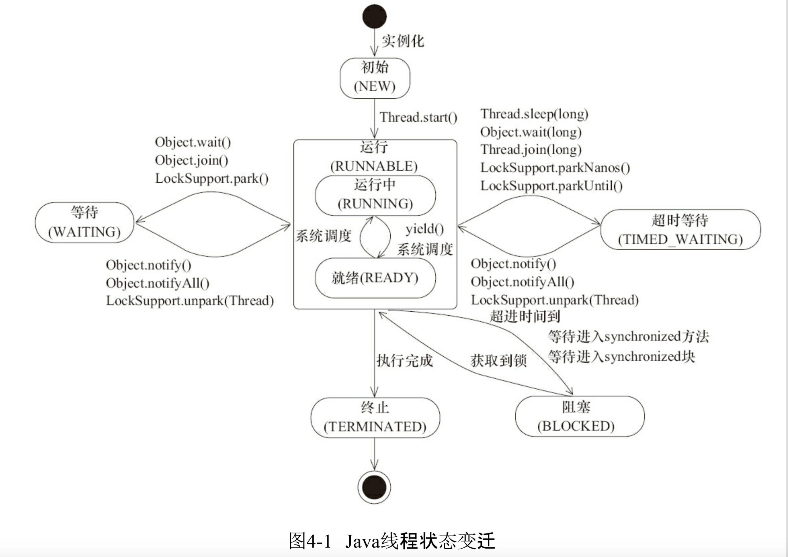

# 线程基础知识

## 为什么要使用多线程

1. 通过多线程的并行计算，可以更好的利用现代CPU资源
2. 将主线程事务中的可分离的部分，交由其它线程异步的执行从而提升主线程事务的响应时间

## 线程的优先级、daemon线程、状态

* 线程调度是需要CPU的时间片的，线程的优先级越高分配的CPU时间片就越多 setPriority(int) 设置
* Java中如果没有正在运行的用户线程，Java就会退出,我们默认创建的线程都是用户线程，因此下面的代码，如果将deamon设置为true不会得到 "daemonTest end" 的输出

``` 
public class DaemonThread {
    public static void main(String[] args) {
        System.out.println(System.currentTimeMillis()+" Main started!");
        Runnable runnable = new Runnable() {
            @Override
            public void run() {
                Sleep.second(1);
                System.out.println(System.currentTimeMillis()+" daemonTest end!");
            }
        };
        Thread thread = new Thread(runnable,"daemonTest");
        thread.setDaemon(true);
        thread.start();
        System.out.println(System.currentTimeMillis()+" Main exit!");
    }
}
```

* 线程的状态,线程的状态就是对Java线程不同声明周期的描述 [com.izhengyin.demo.concurrent.basic.thread.state](src/com/izhengyin/demo/concurrent/basic/thread/state) 查看源码示例
   * NEW 线程被创建，未调用Start
   * RUNNABLE 运行中
   * BLOCKED 阻塞状态，表示线程阻塞于锁
   * WAITING 等待状态，需要进行唤醒
   屏幕快照 2020-11-08 下午3.55.44* TIME_WAITING 超时等待状态，可以在指定时间返回
   * TERMINATED 线程被终端
   
   
   
## 线程的通讯

* 线程之间数据的同步（volatile synchronized) 可以让线程去主内存中获取数据,为多线程数据同步提供了方法
* 等待/通知机制可以控制线程的调度，为线程的执行的编排提供了可能
* Join机制可以在线程执行完成后得到响应，因此可以根据上下文对线程执行完成后进行逻辑处理
* ThreadLocal提供以线程为命名空间，对数据进行隔离的一种实现,对线程在运行期间独占一些数据提供了方法

